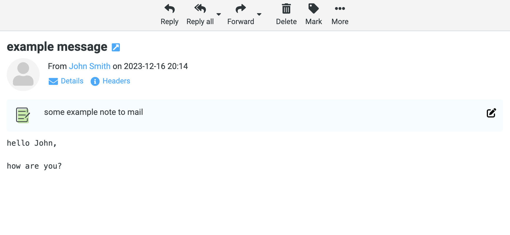

# Roundcube Email Notes

This plugin allows you to add notes to emails.

## Installation
To install, get the plugin with composer in your roundcube directory
```
composer require prefo-pl/email_notes
```

In `config.inc.php`, register the plugin with
```php
$config['plugins'] = [
    'email_notes',
];
```

## Screenshot
The plugin allow to add personal note for e-mail. Note will be storage in database and available only via Roundcube.
<br/>


## License
Permissively licensed under the MIT license
